```{r setup, include = FALSE}
knitr::opts_chunk$set(echo = FALSE, cache = FALSE, cache.path = "cache/", 
                      message = FALSE, warning = FALSE, 
                      fig.ext='png', fig.align = "center", 
                      fig.path = "images/", fig.pos = "H",
                      fig.asp = 1, out.width = "70%",
                      dpi = 600)
type <- knitr::opts_knit$get("rmarkdown.pandoc.to")
library(FinCal)
library(readr)
library(appraiseR)
library(stargazer)
library(proj4)
library(pander)
library(knitr)
library(kableExtra)
library(latex2exp)
library(dplyr)
#library(TeachBayes)
library(LearnBayes)
library(latex2exp)
library(ggplot2)
theme_set(theme_bw())
# library(ggthemes)
library(ggfortify)
library(car)
library(highlight)
library(Hmisc)
library(rvest)
library(lubridate)
```

```{r, include = FALSE}
quadras <- st_read("./docs/Quadras.geojson", "Quadras")
# quadras <- within(quadras, PU <- 64.34*Area^(-.0996)*2.23^3)
# quadras <- within(quadras, PT <- PU*Area)
# st_write(quadras, "./docs/Quadras.geojson", delete_dsn = T)
```


```{r variaveis, echo = FALSE}
# BDI
BDIUrb <- params$BDIUrb # BDI da empresa de construção (urbanização)
DILot <- params$DILot # sem Lucro, Despesas de Venda e Impostos
# Despesas para venda
Dv <- params$Dv # Despesas de Venda (Corretagens)
L <- params$L   # Lucro do Loteador
Tx <- params$Tx # Impostos
# Taxas
Ra <- params$Ra/100 # Taxa de Juros do Capital Investido
ra <- (1 + Ra)^(1/12) - 1
Rb <- params$Rb/100 # Taxa de Juros do Capital Realizado
rb <- (1 + Rb)^(1/12) - 1
Infl <- params$Infl/100 # Inflação (a.a.)
infl <- (1 + Infl)^(1/12) - 1
P <- params$P/100 # Prêmio de Risco (% da Ra)
Ia <- params$Ia/100
M <- params$M/100 # Taxa de Desconto para o IPTU (transf. da gleba em lotes)
V <- params$V/100 # 
# Prazos
Ta <- params$Ta # Prazo Total do Empreendimento (urbanização + vendas)
Na <- params$Na # Prazo Estimado para a venda dos lotes
# Caracteristicas da gleba
Ag <- params$Ag # Área Total da Gleba
Av <- params$Av # Áreas Verdes
Ai <- params$Ai # Área Institucional
Au <- params$Au # Área dos Lotes
Ar <- params$Ar # Área dos arruamentos
Fu <- Au/Ag
# Despesas com aquisicao da gleba
Dc <- params$Dc
Cd <- params$Cd # Eventuais custos de demolição
# Divisao das Etapas
VUlote <- params$VUlote
Alote <- params$Alote
Lotes <- Au/Alote
Etapas <- params$Etapas
n1 <- sum(quadras[which(quadras$Fase==1), "Lotes", drop = T])
n2 <- sum(quadras[which(quadras$Fase==2), "Lotes", drop = T])
n3 <- sum(quadras[which(quadras$Fase==3), "Lotes", drop = T])
# Duração das Etapas
Vv <- params$Vv # /mês - Velocidade de Vendas
D0 <- params$D0
D1 <- trunc(n1/Vv)
D2 <- trunc(n2/Vv)
D3 <- trunc(n3/Vv)
Nsim <- params$Nsim
range_CC <- params$range_CC
range_VU <- params$range_VU
range_TMA <- params$range_TMA
names(range_CC) <- c("min", "max")
names(range_VU) <- c("min", "max")
names(range_TMA) <- c("min", "max")
```

```{r dados}
Vlote <- VUlote*Alote
VL <- (n1+n2+n3)*Vlote
pini <- read_csv2(params$pini) |>
  mutate(`%` = params$porcentagem,
         `Valor Unitario` = Custo*`%`/1000,
         `Valor Total` = `Valor Unitario`*Au)
CUC <- sum(pini$`Valor Unitario`)
```

\newpage

# Resumo {-}

1. **Nome Oficial**: Fazenda Rio Grande

2. **Endereço do Imóvel**: `r params$endereco`.

3. **Tipo do Imóvel**: Terreno (gleba)

4. **Solicitante**: `r params$interessado`.

5. **Proprietário**: `r params$proprietario`

6. **Objetivo**: `r params$objetivo`.

7. **Finalidade**:  `r params$finalidade`.

8. **Resumo dos Valores de Avaliação**:

\begin{center}
\textbf{Estimativa de Valor Central:}
\end{center}

$$V_{gleba} = \text{R\$ }161.000.000,00 $$

\begin{center}
\vspace*{2\baselineskip}
\textbf{Intervalo de Valores Prováveis:}
\end{center}

$$[148.400.000,00; \;174.150.000,00]$$

9. **Especificação**: `r params$fundamentacao`.

10. **Data de Referência**: `r format(params$data_referencia, "%b/%Y")`

11. **Responsáveis técnicos**: \theauthor

\newpage

# Introdução

O presente Laudo foi elaborado seguindo os preceitos NBR-14.653 -- Norma 
Brasileira para Avaliação de Bens -– Partes 1 e 2 -- da Associação Brasileira de 
Normas Técnicas [@NBR1465301; @NBR1465302].

##  Objeto

O imóvel objeto da avaliação é uma gleba constituída de duas matrículas
independentes, situados em perímetro urbano, mais especificamente localizado
na Zona Urbana Intermediária, segundo plano diretor de Primavera do Leste/MT,
conforme mapa apresentado no [ANEXO VIII]. O imóvel apresenta atualmente uso
rural (cultivo de soja e milho), contando com área de `r brf(Ag/10000)` ha,
(`r brf(Ag)` $m^2$), localizado à margem esquerda da Rodovia BR-070, km 272.

# Objetivo e Finalidade

- **Objetivo**  

`r params$objetivo`.

- **Finalidade**  

`r params$finalidade`.

# Metodologia Adotada

`r params$metodo`.

## Escolha com justificativa:

A NBR 14.653-1/2019[@NBR1465301], conceitua o Método Involutivo em seu item 
7.2.2, *in verbis*:

\epigraph{Método Involutivo: Identifica o valor do bem, alicerçado no seu 
aproveitamento eficiente, baseado em modelo de estudo de viabilidade 
técnico-econômica, mediante hipotético empreendimento compatível com as 
características do bem e com as condições do mercado no qual está inserido, 
considerando-se cenários viáveis para execução e comercialização do produto. O
método involutivo pode identificar o valor de mercado. No caso de utilização de
premissas especiais, o resultado é um valor especial.}{NBR 14.653-01 \\ 7.7.2} 

Utilizou-se o Método Involutivo devido a inexistência de imóveis em quantidade 
necessária e suficientemente semelhantes ao avaliando para adoção do Método 
Comparativo Direto de Dados de Mercado. Tal limitação justifica o emprego do
método involutivo. 

# Documentação utilizada 

Consigna-se que o presente trabalho avaliatório considerou como documentação de 
referência:

- Cópia (digitalizada) da Certidão de inteiro teor, datada de 04/03/2024, 
referente à Matrícula nº 45.556, emitida pelo Registo de Imóveis da 
Circunscrição da Comarca de Primavera do Leste (MT); 
- Cópia (digitalizada) da Certidão de inteiro teor, datada de 27/05/2025, 
referente à Matrícula nº 34.497, emitida pelo Registo de Imóveis da 
Circunscrição da Comarca de Primavera do Leste (MT);
- Arquivo KML (*Keyhole Markup Language*), disponibilizado pelo solicitante, com
a identificação da poligonal dos imóveis constantes nas matrículas nº 45.556 e 
nº 34.497, com áreas de 176,22 ha e 139,76 ha, respectivamente.
- Certificados de Cadastro de Imóvel Rural (CCIR) do INCRA, Emissão Exercício
2019

A documentação acima referida (exceto arquivo KML) pode ser vista no [ANEXO IX].

# Pressupostos, ressalvas e fatores limitantes

O avaliador considera que os elementos a ele fornecidos são legítimos e que as
informações prestadas por terceiros foram dadas de boa fé, merecendo, portanto,
todo o crédito.

Foram admitidas como verdadeiras as informações constantes nos documentos e
projetos/plantas de engenharia fornecidos pelo solicitante, tais como áreas,
dimensões, confrontantes, compartimentos, tipologias entre outras
características inerentes ao avaliando. Referidas informações não foram objeto
de validação minuciosa pelo avaliador. Ao contrário, por ocasião da vistoria,
foram observados apenas aspectos gerais, com base em inspeção visual, sem a
utilização de instrumentos de precisão. O avaliador não assume responsabilidade
sobre matéria legal ou de engenharia, fornecidos pelo interessado. Caso ocorram
alterações ou não se confirmem as referidas informações, o(s) valor(es)
apresentados deverão ser revistos pelo avaliador.

O imóvel foi avaliado na suposição de que esteja livre e desembaraçado
de quaisquer ônus, encargos ou gravames de qualquer natureza que possam
afetar o seu valor, pressupondo que as áreas e características informadas, bem
como seus respectivos títulos estejam corretos e que a documentação enviada
para consulta seja a vigente.

Consigna-se que o presente trabalho avaliatório considerou como premissa da
avaliação que o imóvel avaliando, denominado ao longo deste laudo de “Fazenda
Rio Grande”, é constituído por dois terrenos com matrículas independentes (nº
45.556 e nº 34.497), porém contíguos, perfazendo uma área total de 315,97 ha,
conforme arquivo KML (*Keyhole Markup Language*) disponibilizado pelo
solicitante. Registra-se que a referida área (315,97 ha) diverge do somatório
das áreas informadas nas Certidões e nos Certificados de Cadastro de Imóvel
Rural (CCIR) dos supracitados imóveis (matrículas nº 45.556 e nº 34.497).
Contudo, conforme previamente acordado com o solicitante, o pressuposto desta
avaliação é considerar a área total informada no arquivo KML, ou seja, 315,97
ha.

O signatário não assume responsabilidade sobre matéria legal ou de
engenharia, fornecidos pelo interessado.

Não foram efetuadas quaisquer análises jurídicas da documentação do
imóvel, por não se integrarem com o escopo desta avaliação, não tendo sido
efetuadas medições de campo para a finalidade desta avaliação. Não foram
consultados os órgãos públicos de âmbito Municipal, Estadual ou Federal,
quanto à situação legal do imóvel perante os mesmos.

Nenhum estudo de impacto ambiental foi solicitado ou realizado. Para efeito de
avaliação, partiu-se do pressuposto da inexistência de passivo ambiental sobre o
bem, sendo assumida a total obediência às leis e regulamentos ambientais no
âmbito federal, estadual e municipal, a menos que declarado em contrário.

A respeito das áreas verdes, constatou-se que os imóveis possuem área menor do 
que 4 módulos fiscais. Nesta situação, a Reserva Legal do imóvel é constituída 
da vegetação nativa presente na data de 22/07/2008, conforme código florestal
vigente (ver [link](https://www.embrapa.br/codigo-florestal/area-de-reserva-legal-arl)).
Conforme consultas à especialistas em perícias ambientais, considerou-se,
de comum acordo com o Contratante, que as áreas identificadas como de vegetação
nativa não tiveram seu uso modificado no projeto hipotético. Considerou-se
ainda, também de comum acordo com o Contratante, que a alteração de uso do 
imóvel (rural para industrial) será feita mantendo-se a área de reserva legal
existente, conforme orientação de perito ambiental consultado.

Esta avaliação é independente e livre de quaisquer vantagens ou
envolvimento das pessoas que realizaram os serviços.

Os valores encontrados estão fixados em moeda corrente Real (R$) e
para a data base de seus cálculos.

Registra-se que a estimativa do valor de mercado do lote paradigma – integrante
do  projeto hipotético do loteamento industrial -- com a finalidade de subsidiar
a aplicação do Método Involutivo para determinar o valor da gleba objeto da
presente avaliação, consta no [ANEXO I].

As avaliações foram feitas de acordo com as normas brasileiras de
avaliação NBR 14653-1 – \say{Avaliação de bens – Parte 1: Procedimentos Gerais}
[@NBR1465301] e NBR 14653-2 – \say{Avaliação de bens – Parte 2: Imóveis urbanos}
[@NBR1465302].

# Localização do Imóvel

Trata-se de uma gleba, denominada de \say{Fazenda Rio Grande}, localizada às 
margens da Rodovia BR-070, Km 272, na cidade de Primavera do Leste (MT), 
constituída por dois terrenos com matrículas independentes, com números
`r params$matricula`, porém contíguos, perfazendo uma área total de 315,97 ha 
(ver [Pressupostos, ressalvas e fatores limitantes]). 

A título de referência, registra-se que o imóvel avaliando está situado na 
vizinhança do distrito industrial José de Alencar, em zona de expansão urbana, 
lado esquerdo da rodovia BR-070, distando cerca de 3,5 km do conglomerado urbano
de Primavera do Leste. 

As coordenadas geográficas registradas na porteira de acesso do imóvel (BR-070):
-15.542142, -54.238286; Datum: WGS 84

OBS.: Os limites e confrontantes do imóvel avaliando podem ser visualizados no 
arquivo KML (*Keyhole Markup Language*) disponibilizado pelo solicitante.

Registra-se que o avaliando apresenta formato irregular, topografia com leve 
aclive para os fundos e solo aparentemente seco.

A Figura \ref{fig:Perimetro} mostra a localização do imóvel avaliando sobre uma
imagem de fundo de satélite obtida de *Stadia Maps*.


```{r, include=FALSE}
library(sf)
library(ggmap)
sbfl <- c(left = -54.25, bottom = -15.56, 
          right = -54.215, top = -15.532)
gleba <- st_read("./docs/Propriedade.geojson")
gleba <- st_transform(gleba, crs = 4326)
```


```{r Perimetro, fig.cap="Localização do imóvel avaliando.", out.width="90%", cache=TRUE}
get_stadiamap(sbfl, zoom = 15, maptype = "stamen_terrain") |> 
  ggmap() +
  # coord_sf(crs = st_crs(31982)) + # force the ggplot2 map to be in 31982
  geom_sf(data = gleba, aes(fill = Area, alpha = .05), inherit.aes = FALSE, show.legend = FALSE) 
```


## Descrição da região, entorno e acessos

O avaliando está situado em Primavera do Leste (MT), município localizado a 
aproximadamente 239 km da capital, Cuiabá. Este possui uma área de 5.247,897 
$km^2$, com população total estimada em 68.523 habitantes, o que corresponde a 
uma densidade demográfica de aproximadamente 13,06 habitantes/$km^2$ (IBGE, 2022).

As principais atividades econômicas do município estão ligadas ao agronegócio, 
destacando-se a produção de soja, milho, algodão e feijão, além da produção de 
arroz e sorgo. Outras cadeias produtivas relevantes incluem a bovinocultura de 
corte e leite, bem como a avicultura e a suinocultura. O município também possui
crescente atividade industrial, especialmente nas áreas de beneficiamento de 
grãos, produção de insumos agrícolas e apoio logístico ao setor agroindustrial.

Primavera do Leste vem apresentando constante crescimento econômico e 
demográfico nas últimas décadas, impulsionado principalmente pelo avanço do 
agronegócio e pela consequente atração de empresas e indústrias do setor. O 
desenvolvimento urbano tem acompanhado esta expansão, resultando em melhorias na
infraestrutura local e maior diversificação da economia municipal.

# Vistoria

A vistoria foi realizada em `r format(params$data_vistoria, "%d/%m/%Y")`. As
Figuras abaixo ilustram a situação da propriedade na data da vistoria. 

As Figuras \ref{fig:Porteira1} e \ref{fig:Porteira2} mostram que a propriedade o
acesso  principal da propriedade, pela BR-070. A Figura \ref{fig:Sede} mostra a
pequena sede existente, com ligação de energia e água de poço. A Figura
\ref{fig:Barracao} mostra uma benfeitoria da propriedade (barracão). A Figura
\ref{fig:Carreadores} ilustra como são os carreadores internos da propriedade.
Por fim, a Figura \ref{fig:Vegetacao} mostra que há vegetação esparsa em alguns
pontos da propriedade e, aos fundos, uma vegetação mais densa, mais importante,
por fazer parte de uma área de provável proteção permanente (APP), denominada
Furnas.


```{r Porteira1, fig.cap = "Porteira de acesso da propriedade", out.width="49%", fig.show='hold'}
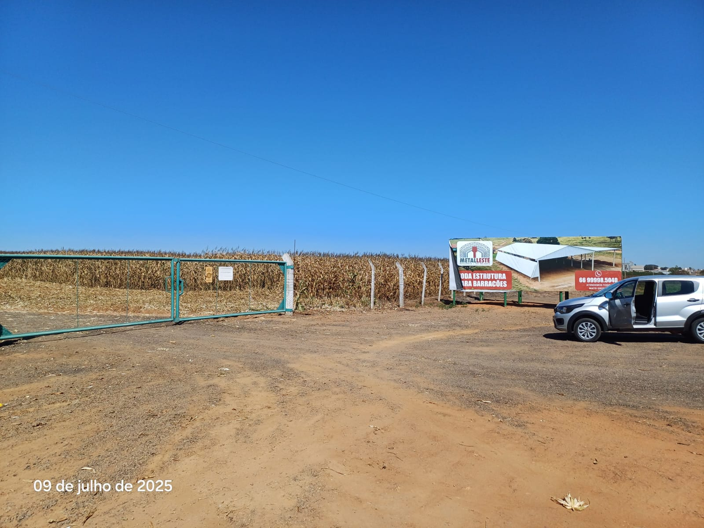
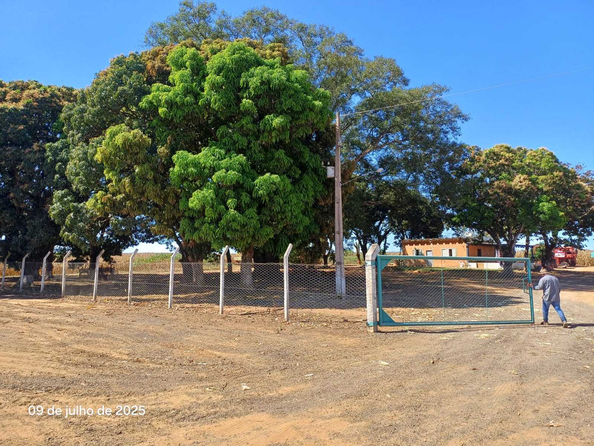

```

```{r Porteira2, fig.cap = "Porteira de acesso da propriedade. Vista Interna."}
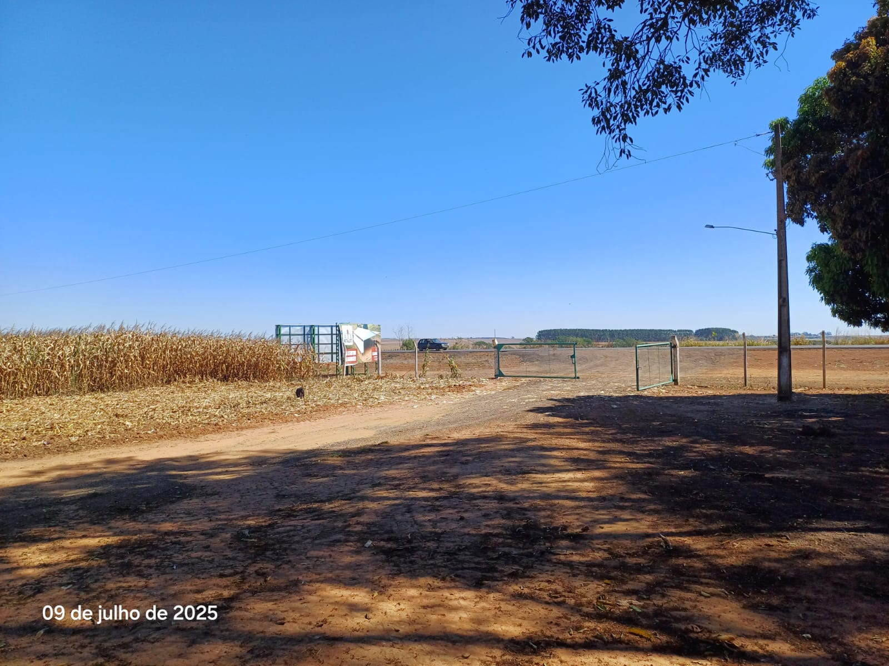
```


```{r Sede, fig.cap = "Sede.", out.width="49%", fig.show='hold'}
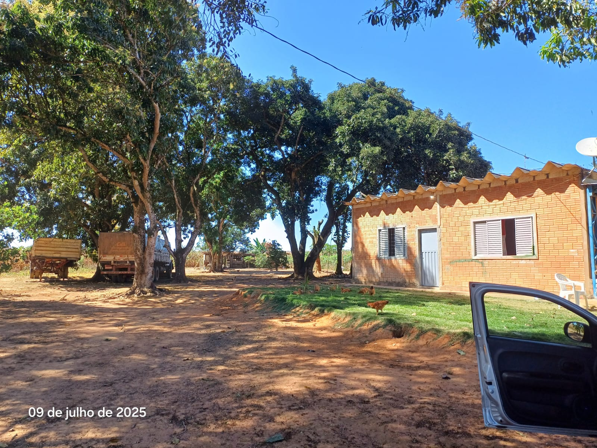
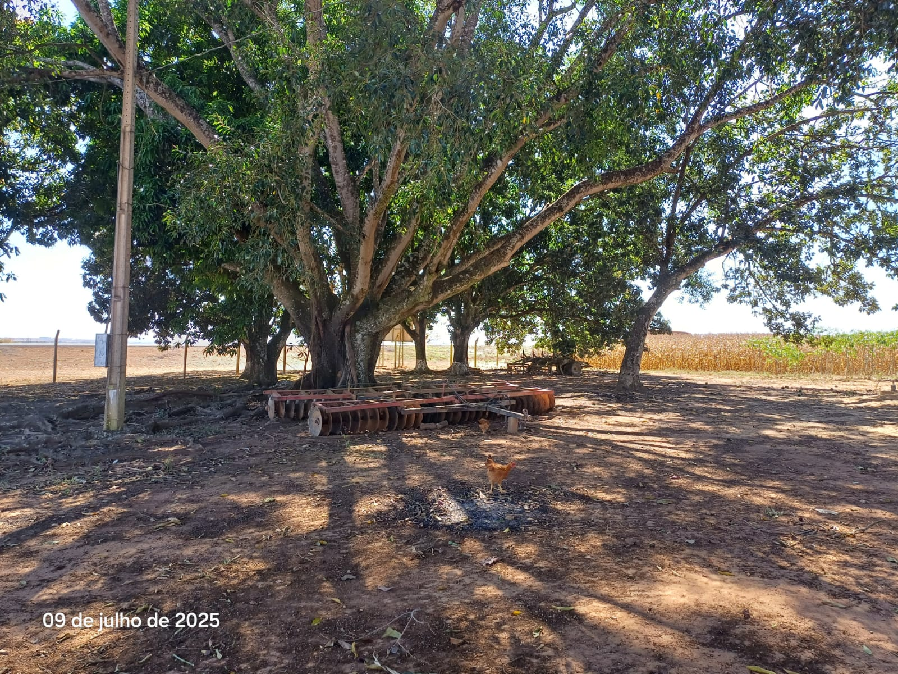
```


```{r Barracao, fig.cap = "Barracão.", out.width="49%", fig.show='hold'}
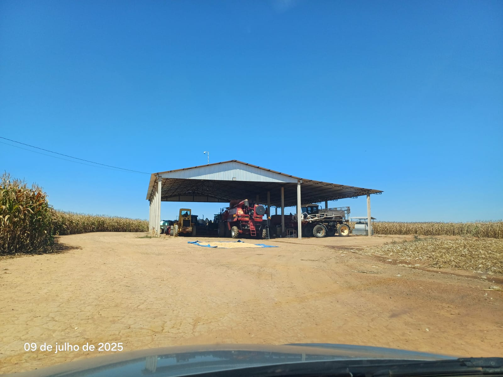
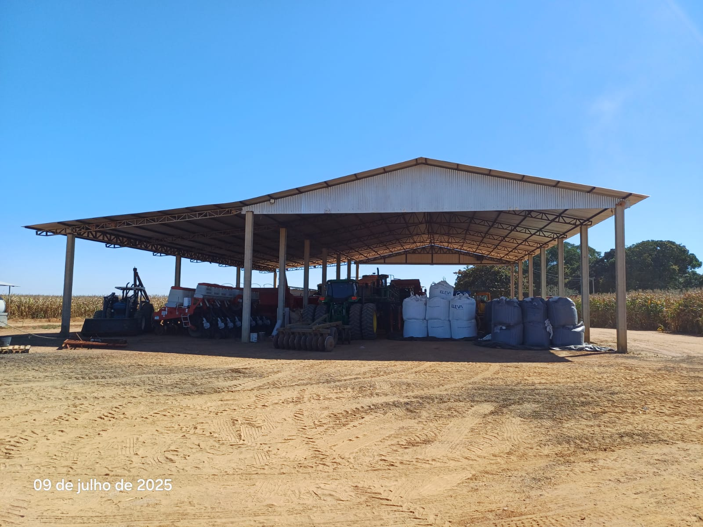
```

```{r Carreadores, fig.cap = "Carreadores internos.", out.width="49%", fig.show='hold'}

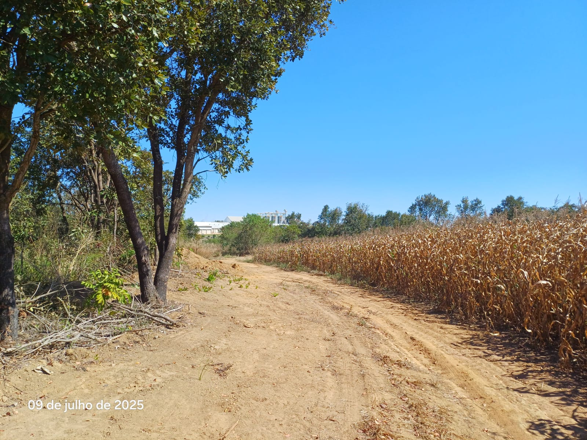
```

```{r Vegetacao, fig.cap = "Vegetação esparsa/APP (Furnas).", out.width="49%", fig.show='hold'}
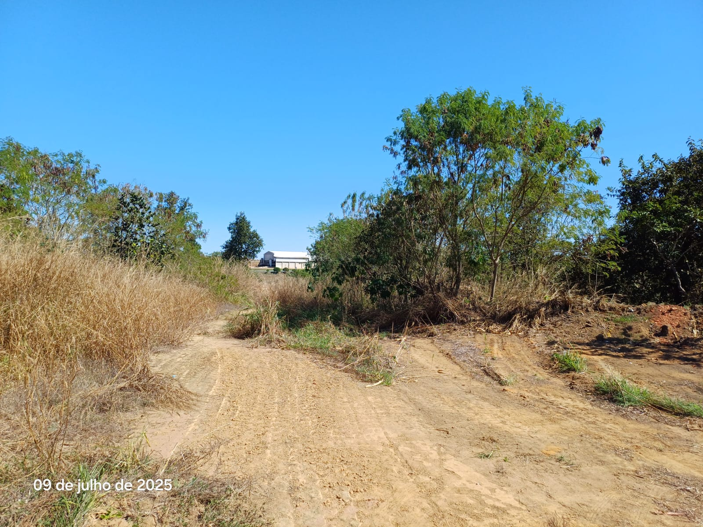
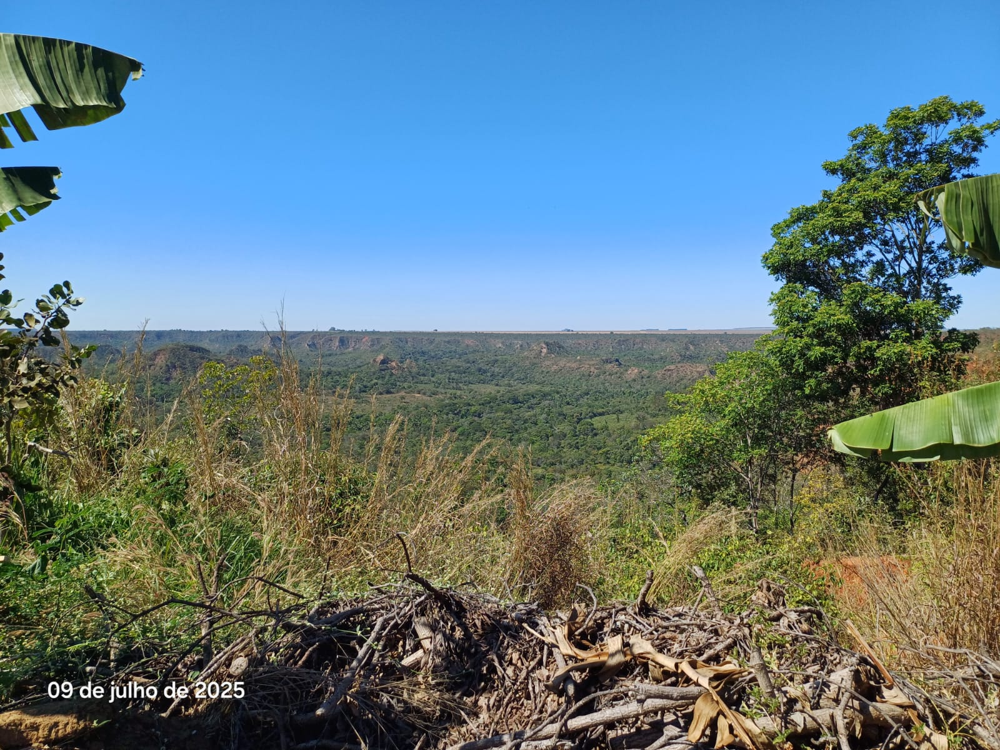
```


# Diagnóstico de Mercado

O imóvel está perfeitamente inserido no mercado de imóveis tipo lotes 
industriais e/ou comerciais, encontrados no local, pois está localizado nas
imediações do distrito José de Alencar, importante distrito industrial local. 
Sua localização é estratégica e tem facilidade de acesso, especialmente por 
estar localizado às margens da Rodovia BR-070.

Quanto à expectativa do avaliador em relação ao desempenho do imóvel
avaliando no mercado, pode-se citar:

a. Quantidade de ofertas de bens similares: pequena em empreendimentos
do tipo do projeto hipotético;
b. Público alvo para absorção do imóvel: pequenas, médias e grandes indústrias,
além de possíveis investidores;
c. Desempenho de mercado: dada a conjuntura atual, com índices de
inflação moderados, taxa de juros alta e expectativa de médio crescimento do
PIB, o mercado de imóveis de maneira geral apresenta médio desempenho;
d. Absorção pelo mercado: a velocidade absorção do imóvel pelo mercado pode ser
considerada de baixa à média;
e. Facilitadores para negociação do bem: localização estratégica e facilidade
de acesso ao centro da cidade;
f. Liquidez: dadas as características do imóvel, público alvo e, principalmente 
da atual conjuntura econômica, um imóvel paradigma pode ser considerado de 
média liquidez.

# Procedimentos metodológicos

## Métodos de avaliação

O método a ser usado numa avaliação, segunda a NBR 14653-1:2019,
depende da natureza do bem a ser avaliado e da finalidade da avaliação, da
qualidade e quantidade de informações coletadas no mercado imobiliário. Sua
escolha deve ser justificada, objetivando-se retratar o comportamento do
mercado por meio de modelos que expliquem seu valor.

Os métodos citados na NBR 14653-1:2019 são:

a. **Métodos para identificar o valor de um bem, de seus frutos e direitos**
  - **Método comparativo direto de dados de mercado:** Identifica o valor de
mercado do bem por meio de tratamento técnico dos atributos dos
elementos comparáveis, constituintes da amostra.
  -  **Método involutivo:** estudo de viabilidade técnico-econômica, mediante
hipotético empreendimento (que considere aproveitamento eficiente do
terreno em avaliação) compatível com as características do bem e com
as condições do mercado no qual está inserido, considerando-se cenários
viáveis para execução e comercialização do produto.
  - **Método evolutivo:** Identifica o valor do bem pelo somatório dos valores
de seus componentes. Caso a finalidade seja a identificação do valor de
mercado, deve ser considerado o fator de comercialização.
  - **Método da capitalização da renda:** Identifica o valor do bem, com base
na capitalização presente da sua renda líquida prevista, considerando-se
cenários viáveis.

b. **Métodos para identificar o custo de um bem**
  - **Método comparativo direto de custo:** Identifica o custo do bem por meio
de tratamento técnico dos atributos dos elementos comparáveis,
constituintes da amostra.
  - **Método da quantificação de custo:** Identifica o custo do bem ou de suas
partes por meio de orçamentos sintéticos ou analíticos a partir das
quantidades de serviços e respectivos custos diretos e indiretos.

c. **Métodos para identificar indicadores de viabilidade da utilização
econômica de um empreendimento**
  - Os procedimentos avaliatórios usuais com a finalidade de determinar
indicadores de viabilidade da utilização econômica de um empreendimento são 
baseados no seu fluxo de caixa projetado, a partir do qual são determinados 
indicadores de decisão baseados no valor presente líquido, taxas internas de
retorno, tempos de retorno, dentre outros.

A NBR 14.653-2:2011 [@NBR1465302] em seu item 8.1.1 coloca que:

\epigraph{Para a identificação do valor de mercado, sempre que possível preferir
o método comparativo direto de dados de mercado (\ldots).}{NBR 14.653-02\\8.1.1}

## Método e Técnicas Adotados

Para a avaliação da gleba foi aplicado o método involutivo, considerando um
loteamento industrial hipotético.

As receitas do empreendimento foram obtidas a partir das vendas dos lotes, 
baseadas no valor de mercado de um lote paradigma, cujo valor foi obtido pelo
método comparativo direto de dados de mercado usando a técnica da regressão 
linear clássica.

Para o levantamento dos desembolsos necessários à urbanização da gleba foi feito
um orçamento usando custos paramétricos.

O modelo econômico-financeiro usado para avaliação da gleba será detalhado a 
seguir.

## Método Involutivo

### Princípio

O método involutivo baseia-se no estudo de viabilidade econômica de 
aproveitamento de um terreno procurando determinar o valor do mesmo através
do estudo das condições máximas permissíveis e com aproveitamento eficiente
da área a ser futuramente utilizada.

O *aproveitamento máximo* é o que as prefeituras municipais permitem em seu 
Plano Diretor, limitado ao mesmo tempos simultaneamente pela capacidade de 
absorção do mercado.

O *aproveitamento eficiente* é a utilização mais adequada para o local em
questão (comercial, residencial, misto, industrial, ...).

### Roteiro de Aplicação

A NBR 14653-2:2011 apresenta as seguintes etapas para a aplicação do método
involutivo (item 8.2.2):

a. **Vistoria do imóvel**: caracterização de região, caracterização do terreno,
caracterização das edificações e benfeitorias do entorno.
b. **Projeto hipotético**: Fazer um projeto de ocupação, considerando o máximo
aproveitamento eficiente do terreno;
c. **Pesquisa de valores**: tem como objetivo estimar o valor de mercado do
produto imobiliário (lote, apartamento, sala comercial, etc.) projetado e sua
variação ao longo do tempo.
d. **Previsão de receitas**: são calculadas a partir da pesquisa de mercado,
devendo-se considerar a eventual valorização imobiliária, a forma de
comercialização e o tempo de absorção no mercado.
e. **Lançamento do custo de produção do PH**: corresponde à apuração dos custos
diretos e indiretos. Principais itens a ser levado em conta:
  - Custos de aquisição e legalização do terreno (impostos e taxas
cartoriais);
  - elaboração e aprovação do projeto;
  - custo da construção, incluindo o lucro do construtor;
  - Lucro do empreendimento (lucro da incorporação)
f. **Previsão de despesas adicionais. Exemplos**:
  - Publicidade;
  - Comercialização das unidades (corretagem).
g. **Margem de lucro do incorporador (item 8.2.2.7)**: Quando for usada margem
de lucro, em modelos que não utilizem fluxo de caixa, esta deve ser
considerada proporcional ao risco do empreendimento, que está diretamente
ligado à quantidade de unidades resultantes do projeto, ao montante
investido e ao prazo total previsto para retorno do capital. A margem de lucro
adotada em modelos estáticos deve ter relação com o que é praticado no
mercado.
h. **Prazos**: no caso de adoção de modelos dinâmicos, é recomendado que:
  - o prazo para a execução do projeto hipotético seja compatível com as
suas características físicas, disponibilidade de recursos, tecnologia e
condições mercadológicas;
  - o prazo para a venda das unidades seja compatível com o mercado.
i. **Taxas**: No caso de adoção de modelos dinâmicos recomenda-se explicitar as
taxas de valorização imobiliária, de evolução de custos e despesas, de juros
do capital investido e a mínima de atratividade.
j. **Modelo**: o valor do terreno é obtido pela diferença entre as receitas e o 
total de custos e despesas. A avaliação poderá ser realizada com a utilização 
dos seguintes modelos, em ordem de preferência:
  - Por fluxos de caixa específicos;
  - com a aplicação de modelos simplificados dinâmicos;
  - com a aplicação de modelos estáticos.  
  
# Construção do Modelo Econômico-Financeiro

Serão detalhados neste item todos os procedimentos usados para a
construção do modelo econômico-financeiro usado para avaliar a gleba.

## Software utilizados

Foi elaborado um [Sistema de Informações Geográficas
(SIG)](https://valoristica.github.io/PrimaveraLeste/) em linguagem *JavaScript*,
em conjunto com a biblioteca [leaflet](https://leafletjs.com/), após a 
confecção das camadas realizada com o auxílio *software* livre QGIS, contendo o
anteprojeto do loteamento hipotético.

Todos os outros cálculos foram efetuados na linguagem \textsf{R}, versão 
`r paste(R.version$major, ".", R.version$minor, sep = "")`.

## Projeto de Loteamento Hipotético

Um Projeto Hipotético (PH) foi elaborado com nível de detalhe suficiente para 
prever o fluxo de caixa do projeto. Não faz parte do escopo deste trabalho a 
construção de um projeto de loteamento detalhado, contemplando a localização 
exata de todos os lotes, áreas institucionais, arruamentos precisos, etc.

A Figura \ref{fig:PH} apresenta, portanto, um estudo preliminar do projeto 
hipotético considerado. Nesta Figura, em verde-escuro podem ser vistas as áreas
verdes a serem preservadas, representando aprox. 23% da área total da gleba; em 
amarelo-escuro podem ser vistas as áreas a serem destinadas para a construção de
lotes (quadras), representando aprox. 67% da área total da gleba. Por fim, as 
áreas institucionais foram consideradas diluídas nos arruamentos, que 
representam aprox. 11% da área total da gleba. 

Deste estudo preliminar foram obtidas as áreas apresentadas na Tabela 1 abaixo:


|Descrição                | Área (m2)   | Proporção      |
|:------------------------|------------:|---------------:|
| Áreas Verdes e de lazer | `r brf(Av)` | `r pct(Av/Ag)` |
| Áreas dos Lotes (útil)  | `r brf(Au)` | `r pct(Au/Ag)` |
| Árruamentos e outros    | `r brf(Ar)` | `r pct(Ar/Ag)` |
Table: Subdivisão do loteamento hipotético.

A Tabela 1 mostra que `r pct(params$Au/Ag)` da área da gleba podem ser
transformados em lotes, totalizando assim `r brf(Au)` $m^2$ de área vendável. 
Considerando um lote paradigma de `r brf(params$Alote)` $m^2$, esta área resulta
em `r trunc(params$Au/params$Alote)` lotes disponíveis para venda.

```{r, include = FALSE}
AV <- st_read("./docs/AreasVerdes.geojson")
# AI <- st_read("../SBFL.gpkg", layer = "AreasInstitucionais")
Q <- st_read("./docs/Quadras.geojson")
AV <- st_transform(AV, crs = 4326)
# AI <- st_transform(AI, crs = 4326)
Q <- st_transform(Q, crs = 4326)
```

```{r PH, fig.cap="Projeto Hipotético.", out.width="70%", cache = TRUE}
get_stadiamap(sbfl, zoom = 14, maptype = "stamen_terrain") |> 
  ggmap() +
  # coord_sf(crs = st_crs(31982)) + # force the ggplot2 map to be in 31981
  geom_sf(data = gleba, aes(fill = Area, alpha = .05), inherit.aes = FALSE, show.legend = FALSE) +
  geom_sf(data = AV, aes(fillColor = "darkgreen"), inherit.aes = FALSE) +
#  geom_sf(data = AI, aes(fillColor = "darkblue"), inherit.aes = FALSE) +
  geom_sf(data = Q, aes(fillColor = "#8B8000"), inherit.aes = FALSE)
```


Devido ao grande número de lotes, o fluxo de caixa do empreendimento
será dividido em `r params$Etapas` etapas de vendas, sendo as duas primeiras com
duração de 17 meses cada e a terceira com 14 meses. Considerou-se ainda que os
lotes começarão a ser vendidos após `r D0` meses do início do projeto. 

Na primeira etapa serão vendidos `r n1` lotes, na segunda etapa serão vendidos 
outros `r n2` e, por fim, na terceira etapa serão vendidos `r n3` lotes. A 
velocidade de venda de `r Vv` lotes mensais foi adotada. A duração total do
empreendimento resultou em `r Ta` meses.

As Figuras \ref{fig:Etapa1} a \ref{fig:Etapas2-3} mostram como foram definidas as
etapas do loteamento. Na Primeira Etapa serão urbanizados e vendidos `r n1`
lotes situados nas quadras adjacentesaos lotes industriais existentes no 
distrito industrial lindeiro. Na Segunda Etapa serão comercializados mais
`r n2` lotes que se encontram na área central da propriedade, nas proximidades 
da atual porteira de acesso principal da propriedade. Já na 3ª e última
etapa são considerados `r n3` lotes residuais encontrados nas quadras situadas 
mais distantes da região central de Primavera do Leste.

```{r}
quadras <- st_transform(quadras, crs = 4326)
```


```{r Etapa1, fig.cap = "Etapa 1.", out.width="70%", cache = TRUE}
get_stadiamap(sbfl, zoom = 14, maptype = "stamen_terrain") |> 
  ggmap(extent = "device") +
  # coord_sf(crs = st_crs(31982)) + # force the ggplot2 map to be in 31982
  geom_sf(data = gleba, aes(fill = Area, alpha = .05), inherit.aes = FALSE,
          show.legend = FALSE) +
  geom_sf(data = quadras[which(quadras$Fase == 1), ], 
          aes(fillColor = "darkblue"), inherit.aes = FALSE)
```


```{r Etapas2-3, fig.cap = "Etapas 2 e 3.", out.width="49%", fig.show='hold', cache = TRUE}
get_stadiamap(sbfl, zoom = 14, maptype = "stamen_terrain") |> 
  ggmap(extent = "device") +
  # coord_sf(crs = st_crs(31982)) + # force the ggplot2 map to be in 31982
    geom_sf(data = gleba, aes(fill = Area, alpha = .05), inherit.aes = FALSE,
            show.legend = FALSE) +
  geom_sf(data = quadras[which(quadras$Fase == 2), ], 
          aes(fillColor = "darkblue"), inherit.aes = FALSE)
get_stadiamap(sbfl, zoom = 14, maptype = "stamen_terrain") |> 
  ggmap(extent = "device") +
  # coord_sf(crs = st_crs(31982)) + # force the ggplot2 map to be in 31982
    geom_sf(data = gleba, aes(fill = Area, alpha = .05), inherit.aes = FALSE,
            show.legend = FALSE) +
  geom_sf(data = quadras[which(quadras$Fase == 3), ], 
          aes(fillColor = "darkblue"), inherit.aes = FALSE) 
```

## Estimativa de Receitas

O valor de cada lote paradigma, conforme apresentado no [ANEXO I] (Laudo do 
Método Comparativo Direto de Dados de Mercado), é `r Reais(Vlote)`. A 
Tabela 2 apresenta um resumo das estimativas de receitas por etapa e do Valor 
Global de Vendas (VGV).

| ETAPA    | LOTES | RECEITA (R$)     |
|:---------|------:|-----------------:|
| 1ª Etapa | 50    |   150.000.000,00 |
| 2ª Etapa | 50    |   150.000.000,00 |
| 3ª Etapa | 42    |   126.000.000,00 |
Table: Estimativas de Receitas por Etapa

## Estimativas de Custos de Urbanização

Para a estimativa dos custos de urbanização foram usados custos publicados pela
PINI, que apresenta valores unitários para 1.000 m2 de área útil do loteamento. 
O [ANEXO II] apresenta uma tabela destes valores.

A Tabela 3 apresenta os custos de urbanização para as diferentes etapas consideradas.

| SERVIÇO                                         | CUSTO PINI | 1ª ETAPA   | 2ª ETAPA   | 3ª ETAPA   |
|:------------------------------------------------|-----------:|-----------:|-----------:|-----------:|
| Topografia                                      | 12.060,06  | 100%       | 100%       | 100%       |
| Terraplanagem leve                              |  2.078,35  | 100%       | 100%       | 100%       |
| Terraplanagem média                             |  5.968,19  | 0%         | 0%         | 0%         |
| Terraplanagem pesada                            | 15.693,02  | 0%         | 0%         | 0%         |
| Rede de água potável                            | 11.959,62  | 100%       | 100%       | 100%       |
| Rede de Esgoto                                  | 28.885,35  | 100%       | 100%       | 100%       |
| Drenagem de Águas pluviais: galerias            | 11.881,14  | 100%       | 100%       | 100%       |
| Drenagem de Águas pluviais: guias e sarjetas    |  9.786,87  | 100%       | 100%       | 100%       |
| Pavimentação                                    | 31.994,26  | 100%       | 100%       | 100%       |
| Rede de Iluminação Pública                      |  3.880,58  | 100%       | 100%       | 100%       |
| CUSTO TOTAL                                     |  -         | 112.526,23 | 112.526,23 | 112.526,23 |
Table: Custo de urbanização por 1.000 m2 de área útil.

Como o loteamento em questão possui diversas quadras que ficam defronte à Rodovia
BR-070, e o proprietário pode vender estas quadras de maneira integral para
grandes indústrias, considerou-se neste laudo que a urbanização se dará apenas
nas quadras internas do loteamento.

A Tabela 4 mostra um resumo dos custos totais de urbanização por etapa.

| ETAPA    | LOTES |  ÁREA ÚTIL (M2)   | CUSTOS (R$)      |
|:---------|------:|------------------:|-----------------:|
| 1ª Etapa | 30    |   450.000,00      |  50.636.803,50   |
| 2ª Etapa | 37    |   555.000,00      |  62.452.057,65   |
| 3ª Etapa | 17    |   255.000,00      |  28.694.188,65   |
| TOTAL    | 84    | 2.130.000,00      | 141.783.049,80   |
Table: Estimativas de Custos de Urbanização por Etapa

```{r}
CC <- 84/142*Au*CUC
# Du <-  CC + Dc*VL + Cd
Proj <- CC*Dc/100
Registro <- 1650000
Di <-  Registro + Proj + Cd
Du <- CC + Di
```


## Benefícios e Despesas Indiretas

Para os benefícios e despesas indiretas (BDI) do urbanizador será adotada a taxa 
de 23,02%, atendendo o Acórdão nº 2622/2013 do Tribunal de Contas da União (TCU)
que estabelece valores de BDI por tipos de obras públicas e para aquisição de 
materiais e equipamentos.

Como não existe especificada a atividade do loteador neste acórdão, fez-se uma
média ponderada pelos custos atribuídos às atividades ali especificadas. Os
custos são aqueles apresentados na Tabela 3, sendo que os custos dos serviços de
topografia são divididos pela metade entre as atividades \say{construção 
de rodovias} e \say{redes de abastecimento de água e coleta de esgoto} 
constantes no referido acórdão. A Tabela 5 apresenta os resultados desta 
ponderação.

| SERVIÇO                | BDI ACÓRDÃO | CUSTOS     | PESO  | BDI URB. |
|:-----------------------|------------:|-----------:|------:|---------:|
| RODOVIAS               | 20,97%      |  40.102,64 | 0,356 |  7,47%   |
| REDES (ÁGUAS + ESGOTO) | 24,18%      |  68.543,01 | 0,609 | 14,73%   |
| REDE ELÉTRICA          | 25,84%      |   3.880,58 | 0,034 |  0,89%   |
| TOTAL                  | -           | 112.526,23 | 1,00  | 23,09%   |
Table: Determinação do BDI do Urbanizador.

A parcela de lucros (benefícios) não foi considerada para o loteador
(empreendedor), pois seus benefícios foram contemplados na taxa usada para
descontar o fluxo de caixa (FC). A Tabela 6 mostra a determinação das despesas
indiretas do loteador para os componentes administração central, seguros mais
garantias e despesas financeiras. Foram considerados os valores do primeiro
quartil sugeridos no Acórdão nº 2622/2013 (TCU), adaptando desta forma estes
custos para o loteador, que tem uma estrutura gerencial mais enxuta. A
ponderação foi efetuada usando-se os mesmos pesos apresentados na Tabela 5.

| SERVIÇO                 | ADM. C.      | S + G             | DESP. FINAN. | SOMA  | DI LOT. |
|:------------------------|-------------:|------------------:|-------------:|------:|--------:|
| RODOVIAS                | 3,80%        | 0,32%             | 1,02%        | 5,14% | 1,83%   |
| REDES (ÁGUAS + ESGOTO)  | 3,43%        | 0,28%             | 0,94%        | 4,65% | 2,83%   |
| REDE ELÉTRICA           | 5,29%        | 0,25%             | 1,01%        | 6,55% | 0,23%   |
| TOTAL                   | -            | -                 | -            | -     | 4,89%   |
Table: Despesas Indiretas do Loteador.

Os custos de comercialização montam em 6% do VGV; os impostos em 6,73% (IRPJ,
CSLL, PIS e COFINS para uma SPE).

Assim, o total das despesas que devem ser descontadas do loteador montam em 
17,62% do VGV.

## Taxas

Baseado na análise realizada em [Diagnóstico de Mercado], não será
considerada explicitamente uma taxa de valorização para os lotes durante o
período de vendas. Mas, pode-se considerar, de maneira conservadora, que
eventuais variações serão suficientes para cobrir as despesas com os impostos
territoriais urbanos (IPTU) que incidirão sobre os lotes, de modo que este
imposto também são será considerado explicitamente no fluxo de caixa.

Na taxa de desconto do fluxo de caixa deve-se considerar o risco do 
empreendimento. Para ajustar a taxa mínima de atratividade (TMA) usada como 
taxa de desconto, foi usada a Equação 1.

\begin{equation}
\text{TMA}_{\text{ajust}} = [(1+i)(1+z)]-1
\end{equation}

Onde:

  - $\text{TMA}_{\text{ajust}}$: é a taxa mínima de atratividade ajustada ao risco;
  - $i$: é a taxa mínima de atratividade, sem risco;
  - $z$: é o prêmio pelo risco (*spread*)
  
O valor do prêmio pelo risco ($z$) será tanto maior quanto maior for o risco
envolvido no empreendimento.

Como taxa sem risco ($i$) foi considerada a taxa de desconto vigente na data da
confecção deste laudo para um título público (LTN) com vencimento em 01/01/2030,
prazo equivalente ao prazo previsto de implantação do empreendimento. Nesta data,
a taxa de desconto deste título foi obtido no site da ANBIMA, conforme mostrado
na Figura \ref{fig:ANBIMA}, e está em aprox. `r pct(Ra)` a.a.:

```{r ANBIMA, fig.cap="Taxas e preços de títulos públicos editada pela ANBIMA."}
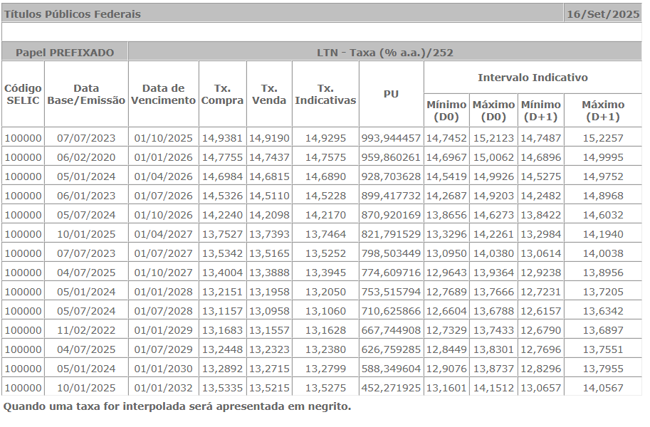
```

A taxa sem risco também é denominada de taxa básica. É necessário fazer-se o 
ajuste da Equação 2 para expurgar a inflação desta taxa.

\begin{equation}
\text{TMA}_{\text{ajust. sem. infl.}} = \frac{1+\text{TMA}_{\text{ajust}}}{1+\text{infl.}}-1
\end{equation}

A taxa de inflação considerada foi a mediana da expectativa do Índice de Preços 
ao Consumidor Amplo (IPCA), taxa oficial de medição da inflação brasileira, 
para um horizonte de 5 anos. Esta expectativa, na data de confecção deste laudo,
é de 3,90% a.a.

Analisando-se as incertezas relacionadas à conjuntura econômica e a condição de
risco do empreendimento em análise, considerou-se um prêmio de risco de 35% da 
taxa básica adotada. 

A Tabela 7 mostra as taxas consideradas e o resultado do cálculo da TMA ajustada
ao risco, com expurgo da inflação.

```{r}
TMA <- (1+Ra)/(1+Infl) - 1
tma <- (1+TMA)^(1/12) - 1
TMAaj <- (1+Ra)*(1+Ra*P) - 1
TMAajsinfl <- (1+TMAaj)/(1+Infl) - 1
tmaajsinfl <- (1+TMAajsinfl)^(1/12) - 1
```


| DESCRIÇÃO                                     | TAXA                |
|:---------------------------------------------:|--------------------:|
| Taxa básica (a.a.)                            | `r pct(Ra)`         |
| Taxa básica (a.m.)                            | `r pct(ra)`         |
| IPCA (a.a.)                                   | `r pct(Infl)`       |
| IPCA (a.m.)                                   | `r pct(infl)`       |
| Taxa de desconto sem infl. e sem risco (a.a.) | `r pct(TMA)`        |
| Taxa de desconto sem infl. e sem risco (a.m.) | `r pct(tma)`        |
| Prêmio de risco (% da taxa básica)            | `r pct(P)`          |
| Taxa com inflação, com risco (a.a.)           | `r pct(TMAaj)`      |
| Taxa sem inflação, com risco (a.a.)           | `r pct(TMAajsinfl)` |
| Taxa sem inflação, com risco (a.m.)           | `r pct(tmaajsinfl)` |
Table: Taxas consideradas para o cálculo da TMA.


Conforme apresentado na Tabela 7, a taxa mínima de atratividade ajustada ao 
risco e expurgada da inflação é de `r pct(tmaajsinfl)` a.m.


## Fluxo de Caixa

```{r}
Vbg <- 165784898.5
Vg <- Vbg - Di
```

O fluxo de caixa (FC), elaborado conforme as premissas acima, é mostrado no 
[ANEXO III]. O FC foi construído em moeda constante, valores de 
`r format(params$data_referencia, "%b/%Y")`.

A Tabela \ref{tab:RD} detalha as receitas e as despesas, período a período.

A Tabela \ref{tab:FCL} apresenta o fluxo de caixa líquido do empreendimento.

O Valor Presente Líquido (VPL) deste fluxo de caixa representa o valor do 
terreno, antes do desconto de despesas iniciais utilizadas para a aquisição da
gleba, projetos, demolições, e outros. O desembolso destas despesas ocorre, em 
geral, antes do início da execução física do projeto. Estas despesas serão 
apresentadas e comentadas na próxima seção.

O Valor Presente Líquido (VPL) do fluxo de caixa do empreendimento, descontadas
as despesas iniciais da Tabela 8, é de `r Reais(Vg)`.

## Outras Despesas

Algumas despesas iniciais adicionais também devem ser consideradas. Despesas com
o registro do loteamento e outras taxas cartoriais eventualmente necessárias
foram consideradas como incidindo sobre o valor do terreno, da ordem de 1%. 
Para as despesas com a aquisição dos projetos do loteamento, foi considerado 2%
sobre os custos de urbanização.

A Tabela 8 apresenta estes custos.

| ITEM                           | TAXA          | REFERÊNCIA          | VALOR (R$)         |
|:-------------------------------|--------------:|--------------------:|-------------------:|
| Despesas cartoriais            | $\approx1\%$  | `r brf(Vg)`         | `r brf(Registro)`  |
| Projeto                        | 2\%           | `r brf(CC)`         | `r brf(Proj)`      |
| Demolições                     | -             | -                   | `r brf(Cd)`        |
| Total                          | -             | -                   | `r brf(Di)`        |
Table: Despesas iniciais.


# Enquadramento do Laudo

Conforme recomendado em @NBR1465302, o presente trabalho enquadra-se como 
`r params$fundamentacao`. Não há para o método involutivo classificação
quanto ao grau de precisão. A Tabela \ref{tab:GF} mostra como o laudo se enquadra
em cada item da @NBR1465302.


```{r GF}
df <- data.frame(
  Item = c(1:9),
  `Descrição` = c("Nível de detalhamento do projeto hipotético",
                  "Preço de venda das unidades do projeto hipotético",
                  "Estimativa dos custos de produção",
                  "Prazos",
                  "Taxas",
                  "Modelo",
                  "Análise setorial e diagnóstico de mercado",
                  "Cenários",
                  "Análises de sensibilidade do modelo"),
  `Grau III` = c("Anteprojeto ou projeto básico", 
                 "No mínimo Grau II de fundamentação no método comparativo",
                 "Grau III de fundamentação no método da quantificação do custo",
                 "Fundamentados com dados obtidos no mercado",
                 "Fundamentadas com dados obtidos no mercado",
                 "Dinâmico com fluxo de caixa",
                 "De estrututura, conjunta, tendências e conduta",
                 "Mínimo de 3",
                 "Simulações com discussão do comportamento do modelo"),
  `Grau II` = c("Estudo preliminar",
                "Grau I de fundamentação no método comparativo",
                "Grau II de fundamentação no método da quantificação do custo",
                "Justificados",
                "Justificadas",
                "Dinâmico com equações pré-definidas",
                "Da conjuntura",
                "2",
                "Simulações com identificação das variáveis mais significativas"),
  `Grau I` = c("Aproveitamento, ocupação e usos presumidos",
               "Estimativa",
               "Grau I de fundamentação no método da quantificação do custo",
               "Arbitrados",
               "Arbitradas",
               "Estático",
               "Sintéticos da conjuntura",
               "1",
               "Sem simulação"),
  Laudo = c("II", "III", "I", "II", "II", "III", "II", "III", "III")
)
kable(df,
      caption = "Graus de fundamentação para o método involutivo. 
      Fonte: adaptada de NBR 14.653-2", 
      format = "latex", longtable = T, booktabs = T,
      col.names = c("Item", "Descrição", "Grau III", "Grau II", "Grau I", "Laudo")) |>
  kable_styling(latex_options = "repeat_header") |>
  column_spec(2:5, width = "2.5cm")
```

A Tabela 10 mostra o enquadramento para obtenção do grau de fundamentação 
atingido na presente avaliação.

| Graus                                     | III                                          | II                   | I                           |
|:------------------------------------------|:--------------------------------------------:|:--------------------:|:---------------------------:|
| Pontos Mínimos                            | 22                                           |  13                  | 9                           |
| Pontos Obtidos                            | 21                                           | -                    | -                           |
| Itens Obrigatórios no grau correspondente | 2,6,7 e 8, com demais no mínimo no grau II   | 2,6,7 e 8 no grau II | Todos, no mínimo, no grau I |
Table: Enquadramento do presente laudo.

Dado que não foram atingidos os 22 pontos necessários ao enquadramento no Grau
III de Fundamentação, e o item 7 não se enquadrou no grau III , o laudo atingiu
apenas o `r params$fundamentacao`.

# Determinação do valor mais provável

Temos como valor de mercado mais provável do imóvel total (gleba), considerando
o arredondamento admissível pela Norma [@NBR1465301, item 7.7.1, alínea a.], a
quantia de  `r Reais(pretty(Vg, shrink = 0.01))[1]` (cento e sessenta e um
milhões de reais).

No [ANEXO V] podem ser vistos os resultados da Análise de Sensibilidade das
variáveis utilizadas como *input* para o método involutivo. No [ANEXO VI] é 
possível ver a prospeção de cenários realizada para o empreendimento. Por fim,
no [ANEXO VII] podem ser vistos os resultados de `r brf(Nsim)` simulações de
Monte Carlo realizadas com duas distribuições *a priori* diferentes, a saber,
a distribuição uniforme e a distribuição beta. Maiores detalhes destas 
simulações e nossas considerações são encontradas no próprio [ANEXO VII].

# Encerramento

Admitimos como de boa fé e confiáveis as informações colhidas e documentações
que nos foram fornecidas, aliadas a informações colhidas de terceiros creditados
como idôneos, bem como as pesquisas realizadas e necessárias à formação de
elementos de convicção que possibilitaram a conclusão do presente Laudo.

Os engenheiros responsáveis técnicos signatários do presente laudo se colocam à
disposição para quaisquer esclarecimentos que se fizerem necessários.

O presente Laudo de Avaliação é composto por \pageref{LastPage} páginas,
editadas, numeradas, impressas em uma única face e rubricadas, sendo a última
assinada por seu responsável técnico e os seguintes ANEXOS:

* [ANEXO I] -- Avaliação do Lote Paradigma do Empreendimento Hipotético;
* [ANEXO II] -- Custos de Urbanização;
* [ANEXO III] -- Receitas e Despesas do Empreendimento.
* [ANEXO IV] -- Fluxo de Caixa Líquido do Empreendimento.
* [ANEXO V] -- Análise de Sensibilidade
* [ANEXO VI] -- Análise de Cenários
* [ANEXO VII] -- Simulações de Monte Carlo
* [ANEXO VIII] -- Mapa da Macrozona Urbana de Primavera do Leste/MT

Florianópolis, \thedate


\vspace*{5\baselineskip}


\singlespacing
\noindent
\textbf{Eng.\textordmasculine\ Civil Luiz Fernando Palin Droubi}\newline
CREA Nº 5061849287-0/D-SP\newline
Mestre em Engenharia de Transportes e Gestão Territorial pela UFSC


\vspace*{5\baselineskip}

\noindent
\textbf{Eng.\textordmasculine\ Civil Lutemberg de Araújo Florencio}\newline
CREA Nº 180038699-0/D-PE\newline
Doutor em Engenharia Civil pelo Núcleo de \emph{Real Estate} da Poli/USP


\newpage

# ANEXO I {-}

## Avaliação do Lote Paradigma do Empreendimento Hipotético {-}

\includepdf[pages={-}]{Laudo de avaliação - Lote paradigma (VF).pdf}

\newpage

# ANEXO II {-}

## Custos de Urbanização {-}

```{r pini}
# stargazer(pini, header = FALSE, summary = FALSE,
#           digit.separator = ".", decimal.mark = ",", 
#           digit.separate = 3, digits = 2,
#           title = "Custos de Urbanização (R\\$/1.000$m^2$ de área útil)*")
pander(pini, 
       decimal.mark = ",", big.mark = ".",
       nsmall = 2, digits = 2,
       justify = c('left', 'right', 'right', 'right', 'right'),
       caption = "Custos de Urbanização (R\\$/1.000$m^2$ de área útil)*")
```

*Fonte: Editora PINI Publicação de Junho de 2025.  Custos de Urbanização 
calculados com base no trabalho \say{Avaliação de Glebas –- Subsídios para Pré-Planos}

\newpage

# ANEXO III {-}

## Receitas e Despesas do Empreendimento Hipotético {-}

\newpage

\thispagestyle{empty}
\newgeometry{top=5mm, bottom=5mm, left=10mm, right=10mm} 

```{r}
BDILot <- DILot + Dv + Tx # Sem Lucro (L), que está embutido na TMA
```

```{r}
FluxoCaixa <- function(VUlote, CUC) {
  FC <- data.frame(
  Periodo = 0:Ta,
  V1 = c(rep(0, D0 + 1), rep(Vv, D1), n1-Vv*D1, rep(0, D2+D3+1)),
  V2 = c(rep(0, D0 + 1 + D1), Vv - (n1-Vv*D1), rep(Vv, D2), 
         n2 - Vv*D2 - (Vv - (n1-Vv*D1)), rep(0, D3)),
  V3 = c(rep(0, D0 + D1 + D2 + 2), Vv - (n2 - Vv*D2 - (Vv - (n1-Vv*D1))), 
         rep(Vv, D3-1), 1)
  )
  # Receitas com as vendas (V1, V2 e V3)
  FC <- within(FC, {
    R3 <- V3*VUlote*Alote
    R2 <- V2*VUlote*Alote
    R1 <- V1*VUlote*Alote
  })
  # Distribuição dos Custos de Urbanização entre os períodos
  FC <- within(FC, {
  Av3 <- c(rep(0, 33), 
           c(.01, .02, .04, .06, .08, .12, .16, .20, .24, .30, .36, .42, .50, 
             .58, .66, .72, .80, .85, .88, .90, .92, .94, .96, .98, .99,
                         rep(1, 2)))
  Av2 <- c(rep(0, 15), 
           c(.01, .02, .04, .08, .12, .16, .20, .25, .30, 
             .36, .42, .50, .60, .75, .85, .90, .95, 
             rep(1, dim(FC)[1] - 32)))
  Av1 <- c(0, .01, .02, .04, .08, .14, .20, .26,
              .32, .40, .50, .60, .75, .85, 
           rep(1, dim(FC)[1] - 14))

  })
  # Custos de Urbanização
  FC <- within(FC, {
    D3 <- c(0, na.exclude(Av3 - lag(Av3)))*(n3-25)*Alote*CUC
    D2 <- c(0, na.exclude(Av2 - lag(Av2)))*(n2-13)*Alote*CUC
    D1 <- c(0, na.exclude(Av1 - lag(Av1)))*(n1-20)*Alote*CUC
  })
  # Despesas Totais e Receitas Totais por período
  FC <- within(FC, {
    DT <- D1 + D2 + D3
    RT <- R1 + R2 + R3
  })
  # Receita Total Acumulada e Despesa Total Acumulada
  FC <- within(FC, {
    RTAcum <- cumsum(RT)
    DTAcum <- cumsum(DT)
  })
  # Saldo e Saldo Acumulado
  FC <- within(FC, {
    Saldo <- RTAcum - DTAcum
    SaldoAcum <- cumsum(Saldo)
  })
  FC <- within(FC, {
    RL <- RT*(1-BDILot/100)
    DL <- DT*(1+BDIUrb/100)
    SL <- RL-DL
  })
  return(FC)
}
FC <- FluxoCaixa(VUlote = VUlote, CUC = CUC)
```

```{r RD}
kable(FC[, c("Periodo", "R1", "R2", "R3", "D1", "D2", "D3", "RT", "DT", 
             "RTAcum", "DTAcum", "Saldo", "SaldoAcum")], 
      format = "latex", longtable = T, booktabs = T,
      caption = "Receitas e Despesas.",
      digits = 0,
      format.args = list(big.mark = ".", decimal.mark = ",")) |> 
  kable_styling(latex_options = c("repeat_header"), font_size = 10) |>
  landscape()
```

\restoregeometry


# ANEXO IV {-}

## Fluxo de Caixa do Empreendimento Hipotético {-}

Com as receitas e despesas constantes da Tabela \ref{tab:RD}, foi calculado
o Fluxo de Caixa Líquido do empreendimento, considerando-se para tanto um 
desconto nas receitas brutas de `r pct(BDILot/100)`, referente ao BDI do Loteador, e
um acréscimo nas Despesas Brutas de `r pct(BDIUrb/100)`, referente ao BDI do 
Urbanizador. A Receita Líquida (RL) e a Despesa Líquida (DL) podem ser vistas
na Tabela \ref{tab:FCL}, assim como o Saldo Líquido (SL) do caixa do 
empreendimento.

```{r FCL}
kable(FC[, c("Periodo", "RL", "DL", "SL")], 
      format = "latex", longtable = T, booktabs = T,
      caption = "Fluxo de Caixa Líquido",
      format.args = list(big.mark = ".", decimal.mark = ","))
```

## Valor Presente Líquido

```{r}
library(FinancialMath)
# Sem despesas iniciais
VPL0 <- NPV(cf0 = 0, 
            cf = FC$SL[-1],
            times = FC$Periodo[-1],
            i = tmaajsinfl)
```


```{r}
# Com despesas iniciais
VPL <- NPV(cf0 = -Di,
           cf = FC$SL[-1],
           times = FC$Periodo[-1],
           i = tmaajsinfl)
```


Dado o Fluxo de Caixa Líquido da Tabela \ref{tab:FCL}, com uma taxa de desconto
de `r pct(tmaajsinfl)` a.m., chega-se a um Valor Presente Líquido de 
`r Reais(VPL0)`. Descontando-se as despesas iniciais com taxas cartoriais, 
projetos e demolições, que somam `r Reais(Di)`, calcula-se um Valor Presente 
Líquido para o empreendimento de `r Reais(VPL)`.

\newpage
# ANEXO V {-}

## Análises de Sensibilidade {-}

### Preço de Venda dos Lotes {-}

Inicialmente será verificada a sensibilidade do modelo econômico-financeiro em
relação à varição da variável *Preço de Venda dos Lotes*. Será adotado um 
intervalo de variação de $\pm$ 15% em torno do valor estimado para os lotes, de
`r Reais(VUlote*Alote)`. Assim, o Fluxo de Caixa do Empreendimento será refeito
considerando-se o valor do lote entre `r Reais(.85*VUlote*Alote)` e 
`r Reais(1.15*VUlote*Alote)`.

```{r}
# VULote = R$ 225,00/m2
FC1 <- FluxoCaixa(VUlote = (1-10/100)*VUlote, 
                  CUC = CUC)
VPL1 <- NPV(cf0 = -Di, cf = FC1$SL[-1], times = FC1$Periodo[-1],
                          i = tmaajsinfl)
# VULote = R$ 233,35/m2
FC2 <- FluxoCaixa(VUlote = (1-6.667/100)*VUlote, 
                  CUC = CUC)
VPL2 <- NPV(cf0 = -Di, cf = FC2$SL[-1], times = FC2$Periodo[-1],
                          i = tmaajsinfl)
# VULote = R$ 241,68/m2
FC3 <- FluxoCaixa(VUlote = (1-3.334/100)*VUlote, 
                  CUC = CUC)
VPL3 <- NPV(cf0 = -Di, cf = FC3$SL[-1], times = FC3$Periodo[-1],
                          i = tmaajsinfl)
# VULote = R$ 258,33/m2
FC4 <- FluxoCaixa(VUlote = (1+3.334/100)*VUlote, 
                  CUC = CUC)
VPL4 <- NPV(cf0 = -Di, cf = FC4$SL[-1], times = FC4$Periodo[-1],
                          i = tmaajsinfl)
# VULote = R$ 266,65/m2
FC5 <- FluxoCaixa(VUlote = (1+6.667/100)*VUlote, 
                  CUC = CUC)
VPL5 <- NPV(cf0 = -Di, cf = FC5$SL[-1], times = FC5$Periodo[-1],
                          i = tmaajsinfl)
# VULote = R$ 275,00/m2
FC6 <- FluxoCaixa(VUlote = (1+10/100)*VUlote, 
                  CUC = CUC)
VPL6 <- NPV(cf0 = -Di, cf = FC6$SL[-1], times = FC6$Periodo[-1],
                          i = tmaajsinfl)
```


```{r SensLote, fig.cap="Análise de Sensibilidade. Valor do Lote."}
library(tibble)
df <- tribble(
  ~Var,  ~VUlote                         ,~Vg,
  -.10,     (1-10/100)*VUlote     ,VPL1,
  -.06667,  (1-6.667/100)*VUlote  ,VPL2,
  -.03334,  (1-3.334/100)*VUlote  ,VPL3,
        0,  VUlote                ,VPL,
   .03334,  1.03334*VUlote        ,VPL4,
   .06667,  1.06667*VUlote        ,VPL5,
   .10   ,  1.10*VUlote           ,VPL6
)
ggplot(df, aes(x = VUlote, y = Vg)) +
  geom_point() +
  geom_line() +
  scale_y_continuous(labels = scales::label_currency(big.mark = ".", 
                                                     decimal.mark = ",", 
                                                     prefix = "R$ "),
                     limits = c(125*10^6, 190*10^6)
                     ) +
  scale_x_continuous(labels = scales::label_currency(big.mark = ".", 
                                                     decimal.mark = ",",
                                                     prefix = "R$ ")) +
  labs(title = "Análise de Sensibilidade",
       subtitle = "Em Relação ao VU de venda do Lote.",
       caption = "Variação: +- 10%") + 
  xlab("Valor Unitário (VU) do Lote (R$)") +
  ylab("Valor da gleba (R$)") + 
  theme(axis.text.x = element_text(angle = 45, hjust = 1))
```

### Custos de Urbanização {-}

A sensibilidade do modelo econômico-financeiro em relação à varição da variável 
*Custos de Urbanização* será verificada. Será adotado um  intervalo de variação
de $\pm$ 10% em torno do custo estimado, de `r Reais((n1+n2+n3)*Alote*90978.16/1000)`. 
Como o Fluxo de Caixa do Empreendimento é dividido em três etapas de diferentes
características, a variação do custo de urbanização será realizada aplicando-se
uma variação ao custo de urbanização por 1.000 m2 de área útil previsto em cada
etapa, ou seja, a estimativa será realizada alterando-se o valor previsto de
`r Reais(90978.16)`/1.000m2 de área útil e, posteriormente, refazendo todo o 
Fluxo de Caixa, para aferir a variação no Valor Presente Líquido decorrente 
destas variações.

```{r}
# VULote = R$ 225,00/m2
FC1 <- FluxoCaixa(VUlote = VUlote, 
                  CUC = (1-15/100)*CUC)
VPL1 <- NPV(cf0 = -Di, 
            cf = FC1$SL[-1], times = FC1$Periodo[-1], i = tmaajsinfl)
# VULote = R$ 233,35/m2
FC2 <- FluxoCaixa(VUlote =VUlote, 
                  CUC =  (1-10/100)*CUC)
VPL2 <- NPV(cf0 = -Di, 
            cf = FC2$SL[-1], times = FC2$Periodo[-1], i = tmaajsinfl)
# VULote = R$ 241,68/m2
FC3 <- FluxoCaixa(VUlote = VUlote, 
                  CUC = (1-5/100)*CUC)
VPL3 <- NPV(cf0 = -Di, 
            cf = FC3$SL[-1], times = FC3$Periodo[-1], i = tmaajsinfl)
# VULote = R$ 258,33/m2
FC4 <- FluxoCaixa(VUlote = VUlote, 
                  CUC = (1+5/100)*CUC)
VPL4 <- NPV(cf0 = -Di, 
            cf = FC4$SL[-1], times = FC4$Periodo[-1], i = tmaajsinfl)
# VULote = R$ 266,65/m2
FC5 <- FluxoCaixa(VUlote = VUlote, 
                  CUC = (1+10/100)*CUC)
VPL5 <- NPV(cf0 = -Di, 
            cf = FC5$SL[-1], times = FC5$Periodo[-1], i = tmaajsinfl)
# VULote = R$ 275,00/m2
FC6 <- FluxoCaixa(VUlote = VUlote, 
                  CUC = (1+15/100)* CUC)
VPL6 <- NPV(cf0 = -Di, 
            cf = FC6$SL[-1], times = FC6$Periodo[-1], i = tmaajsinfl)
```

```{r SensCUrb, fig.cap="Análise de Sensibilidade. Custos de Urbanização."}
df <- tribble(
  ~Var,  ~CUrb         , ~Vg,
  -.15, 0.85*CUC, VPL1,
  -.10, 0.90*CUC, VPL2,
  -.05, 0.95*CUC, VPL3,
     0, 1.00*CUC, VPL,
   .05, 1.05*CUC, VPL4,
   .10, 1.10*CUC, VPL5,
   .15, 1.15*CUC, VPL6
)
ggplot(df, aes(x = CUrb, y = Vg)) +
  geom_point() +
  geom_line() +
  scale_y_continuous(labels = scales::label_currency(big.mark = ".", 
                                                     decimal.mark = ",", 
                                                     prefix = "R$ "),
                     limits = c(125*10^6, 190*10^6)
                     ) +
  scale_x_continuous(labels = scales::label_currency(big.mark = ".", 
                                                     decimal.mark = ",",
                                                     prefix = "R$ ")) +
  labs(title = "Análise de Sensibilidade",
       subtitle = "Em Relação aos Custos de Urbanização.",
       caption = "+- 15%") + 
  xlab("Custos de Urbanização (R$/1.000m2)") +
  ylab("Valor da Gleba (R$)") + 
  theme(axis.text.x = element_text(angle = 45, hjust = 1))
```

### Taxa mínima de atratividade {-}

Por fim, foi realizada a análise de sensibilidade da variável *taxa mínima de
atratividade*, incluso o risco. Na prática, foi realizada a alteração do prêmio
de risco, dentro do intervalo de 20% e 50%, o que, por sua vez levou a um
intervalo de varição da taxa mínima de atratividade entre 

```{r}
# Taxa = 1,00% a.m.
VPL1 <- NPV(cf0 = -Di, 
            cf = FC$SL[-1], times = FC$Periodo[-1], i = 0.94/100)
# Taxa = 1,09% a.m.
VPL2 <- NPV(cf0 = -Di,
            cf = FC$SL[-1], times = FC$Periodo[-1], i = 1.02/100)
# Taxa = 1,27% a.m.
VPL3 <- NPV(cf0 = -Di, 
            cf = FC$SL[-1], times = FC$Periodo[-1], i = 1.18/100)
# Taxa = 1,36% a.m.
VPL4 <- NPV(cf0 = -Di, 
            cf = FC$SL[-1], times = FC$Periodo[-1], i = 1.26/100)
```

```{r SensTMA, fig.cap="Análise de Sensibilidade. TMA (%)."}
library(tibble)
df <- tribble(
  ~Premio,   ~TMA   , ~Vg,
  '20,00%', 1.00/100, VPL1,
  '27,50%', 1.09/100, VPL2,
  '35,00%', 1.18/100, VPL,
  '42,50%', 1.27/100, VPL3,
  '50,00%', 1.36/100, VPL4,
)
ggplot(df, aes(x = TMA, y = Vg)) +
  geom_point() +
  geom_line() +
  scale_y_continuous(labels = scales::label_currency(big.mark = ".", 
                                                     decimal.mark = ",", 
                                                     prefix = "R$ "),
                     limits = c(125*10^6, 190*10^6)
                     ) +
  scale_x_continuous(labels = scales::label_percent(big.mark = ".",
                                                    decimal.mark = ",",)) +
  labs(title = "Análise de Sensibilidade",
       subtitle = "Em Relação à TMA.",
       caption = "+- 15% de Prêmio de Risco") + 
  xlab("TMA (%)") +
  ylab("Valor da Gleba (R$)") + 
  theme(axis.text.x = element_text(angle = 45, hjust = 1))
```

\newpage

# ANEXO VI {-}

## Cenários {-}

O estudo de cenários também é recomendado pela @NBR1465302 quando se usa o 
método involutivo.

Comumente, analisam-se 3 cenários: um mais provável ou neutro, um cenário
pessimista e um cenário otimista. Nestes cenários são consideradas variações
simultâneas nas variáveis chaves do fluxo de caixa.

O cenário mais provável é aquele já apresentado para determinar o valor
da gleba.

Para os cenários pessimista e otimista consideram-se variações simultâneas nas
variáveis chaves, todas na mesma direção. Ou seja, uma combinação de variáveis 
que diminuem o valor da gleba (cenário pessimista) ou aumentam o valor dela
(cenário otimista).

### Cenário mais provável {-}

A Tabela 14 abaixo mostra os valores considerados no cenário mais provável.

| Item                         | Variação | Valor                                   |
|:-----------------------------|---------:|----------------------------------------:|
| PU de Venda do Lote          |  0,0%    | `r Reais(VUlote)`$/m^2$                 |   
| Custos de Urbanização        |  0,0%    | `r Reais(CUC)`$/m^2 \text{a.u.}$ |
| Adicional ao Prêmio de Risco |  0,0%    | 35%                                     | 
Table: Cenário mais provável.

### Cenário pessimista {-}

Como a combinação de todos os eventos extremos é pouco provável, tomar-se-ão
situações intermediárias. A Tabela 15 abaixo apresenta as variações consideradas
no cenário pessimista.

| Item                         | Variação   | Valor                                        |
|:-----------------------------|-----------:|---------------------------------------------:|
| PU de Venda do Lote          |  -0,05%    | `r Reais(.95*VUlote)`$/m^2$                  |   
| Custos de Urbanização        |  +0,05%    | `r Reais(1.05*CUC)`$/m^2 \text{a.u.}$ |
| Adicional ao Prêmio de Risco |  +7,50 p.p.|  42,50%                                      | 
Table: Cenário pessimista.


### Cenário otimista {-}

Também neste caso, a combinação de todos os eventos extremos é pouco provável.
Tomar-se-ão, então, situações intermediárias. A Tabela 14 abaixo apresenta as
variações consideradas no cenário pessimista.

| Item                         | Variação   | Valor                                      |
|:-----------------------------|-----------:|-------------------------------------------:|
| Preço de Venda do Lote       | +5,00%     | `r brf(1.05*VUlote)`$/m^2$                 |
| Custos de Urbanização        | -5,00%     | `r brf(0.95*CUC)`$/m^2 \text{a.u.}$ |
| Adicional ao Prêmio de Risco | -7,50 p.p. |   27,5%                                    |
Table: Cenário otimista.

## Resultados {-}

```{r}
# Cenário Pessimista
FC1 <- FluxoCaixa(VUlote = .95*VUlote, 
                  CUC = (1+05/100)* CUC)
VPL1 <- NPV(cf0 = -Di, cf = FC1$SL[-1], times = FC1$Periodo[-1],
                          i = 1.18/100)
# Cenário Otimista
FC2 <- FluxoCaixa(VUlote = 1.05*VUlote, 
                  CUC = .95* CUC)
VPL2 <- NPV(cf0 = -Di, cf = FC2$SL[-1], times = FC2$Periodo[-1],
                          i = 1.02/100)
```


A Tabela 17 mostra os resultados para os 3 cenários simulados. A Figura
\ref{fig:Cenarios} ilustra com um gráfico o impacto no valor da gleba.

| Cenário                      | Valor da Gleba       | Variação (%)                 |
|:-----------------------------|---------------------:|-----------------------------:|
| Pessimista                   | `r Reais(VPL1)`      | `r pct(VPL1/VPL-1)`          |
| Provável                     |  `r Reais(VPL)`      | 0,0%                         |
| Otimista                     | `r Reais(VPL2)`      | `r pct(VPL2/VPL-1)`          |
Table: Cenário otimista.

```{r Cenarios, fig.cap="Valor da Gleba para diferentes cenários."}
df <- tribble(
  ~Cenario     ,   ~Vg,
  "Pessimista" ,  VPL1,
  "Provável"   ,   VPL,
  "Otimista"   ,  VPL2
)
df$Cenario <- factor(df$Cenario, 
                     levels = c("Pessimista", "Provável", "Otimista"), 
                     ordered = T)
ggplot(data = df, aes(x = Cenario, y = Vg)) +
  geom_point() +
  scale_y_continuous(labels = scales::label_currency(big.mark = ".", 
                                                     decimal.mark = ",", 
                                                     prefix = "R$ ")) +
 # geom_label(aes(label = Vg)) +
  labs(title = "Análise de Cenários",
       subtitle = "Com as variáveis valor de venda, custos de urb. e prêmio de risco.",
       caption = "+- 10% em cada variável.") + 
  xlab("Cenário") +
  ylab("Valor da gleba (R$)") + 
  theme(axis.text.x = element_text(angle = 45, hjust = 1))
```

\newpage

# ANEXO VII {-}

## Simulações de Monte Carlo com distribuição uniforme {-}

Foram realizadas $n =$ `r Nsim` simulações de Monte Carlo considerando que as
variáveis-chave VU do Lote Paradigma (VU), Custos de Construção (CC) e Taxa
Mínima de Atratividade (TMA) variam em um determinado *range* de valores 
**de maneira uniforme**. Os *ranges* de valores considerados foram:

- VU: de 90% a 110% do valor da estimativa central para o lote paradigma;
- CC: de 85% a 115% dos custos de urbanização descritos no [ANEXO II];
- TMA: de 85% a 115% da TMA utilizada para estimar o valor central da gleba (`r pct(tmaajsinfl)`).
  
Para a simulação foi adotado que a correlação entre as variáveis segueria o 
exposto na Tabela \ref{tab:dependencia}.
  

```{r rangesandvariables}
ranges <- list(VU = range_VU, 
               CC = range_CC, 
               TMA = range_TMA)
vars <- list(VU = VUlote, CC = CUC, TMA = tmaajsinfl)
```

```{r}
                              #  VU  CUC   TMA
dependencia50 <- matrix(data = c(1,  .5, -.5, # VU
                                .5,   1,  .5, # CUC
                               -.5,  .5,   1),# TMA 
                        nrow = 3, 
                        byrow = TRUE, 
                        dimnames = list(c("VU", "CC", "TMA"),
                                        c("VU", "CC", "TMA"))
                        )
```

```{r dependencia, tab.cap="Matriz de Covariancia -- variaveis 50\\% dependentes"}
dependencia50 |> 
  kable(booktabs = TRUE,
        escape = TRUE)  |>
  kable_styling(latex_options = "striped", 
                bootstrap_options = "striped")
```

Os resultados das simulações podem ser visualizados no histograma da Figura
\ref{fig:unifMC}.

```{r}
vpl_sim <- function(Nsim, ranges, variables, distribution = "uniform",
                    params , dependencia = diag(length(ranges))){

  n <- length(ranges)
  mu <- rep(0, n)
  if (is.null(names(dependencia))) {
    dimnames(dependencia) <- list(names(ranges), names(ranges))
  }
  Sigma <- dependencia

  rawvars <- MASS::mvrnorm(n = Nsim, mu = mu, Sigma = Sigma)
  pvars <- as.data.frame(pnorm(rawvars))

  if (distribution == "uniform"){
    qvars <- list()
    for (nam in names(ranges)){
      qvars[[nam]] <- do.call("qunif",
                              list(pvars[[nam]],
                                   ranges[[nam]]["min"]*variables[[nam]],
                                   ranges[[nam]]["max"]*variables[[nam]]))
    }
    qvars <- tibble::as_tibble(qvars)
  } else if (distribution == "beta"){
    qvars <- list()
    for (nam in names(ranges)){
      qvars[[nam]] <- do.call("qbeta",
                              list(pvars[[nam]],
                                   params[[nam]]["shape1"],
                                   params[[nam]]["shape2"]))
      qvars[[nam]] <-
        (ranges[[nam]]["max"]*variables[[nam]] -
           ranges[[nam]]["min"]*variables[[nam]])*qvars[[nam]] +
        ranges[[nam]]["min"]*variables[[nam]]
    }
    qvars <- tibble::as_tibble(qvars)
  }

  qvars <-
    qvars |>
    dplyr::mutate(fcl = purrr::pmap(list(VUlote = VU, CUC = CC), 
                                    FluxoCaixa)
                  )
  VPL <- 
    qvars |>
    dplyr::mutate(vpl = purrr::map2(fcl, TMA, 
                             function(df, TMA) NPV(cf0 = -Di, cf = df$SL[-1], 
                                                 times = df$Periodo[-1],
                                                 i = TMA)
                     )
    )
  VPL
}
```


```{r}
set.seed(1)
vpl_unif50 <- vpl_sim(Nsim, ranges = ranges, variables = vars,
                  distribution = "uniform", 
                  dependencia = dependencia50)
VPL <- 
  vpl_unif50 |> 
  tidyr::unnest(cols = vpl)
mean_unif50 <- mean(VPL$vpl)
sd_unif50 <- sd(VPL$vpl)
```


```{r unifMC, fig.cap="Simulações de Monte Carlo com distribuição a priori uniforme.", out.width="60%"}
# ggplot(VPL, aes(x = vpl/1000)) +
#   geom_histogram()
library(lattice)
histogram(~vpl/1000, data = VPL)
```


O valor médio dos VPL obtidos com as simulações foi de `r Reais(mean_unif50)`,
com desvio-padrão igual a `r Reais(sd_unif50)`. Apenas 10% dos valores ficaram
abaixo de `r Reais(quantile(VPL$vpl, .1))` e outros 10% ficaram acima de
`r Reais(quantile(VPL$vpl, .9))`. Esta grande dispersão dos valores em torno da
média deve-se ao fato que a distribuição a priori adotada foi a distribuição
uniforme, que atribui igual probabilidade de ocorrência a quaisquer valores
dentro do *range* de valores admissíveis pré-estabelecido.


## Simulações de Monte Carlo com distribuição beta {-}

Nas simulações da seção anterior, a distribuição dos valores dentro do *range* 
de valores pré-estabelecido para cada variável foi considerada uniforme, como
antes esclarecido. No entanto, é razoável supor que há uma maior probabilidade
de ocorrência dos valores centrais do que dos valores extremos dos intervalos
de valores pré-estabelecidos. A distribuição beta é utilizada, em geral, para
simular a maior probabilidade de ocorrência dos valores centrais, propiciando
assim simulações mais realistas. Assim, foram elaboradas $n =$ `r Nsim` 
simulações de Monte Carlo, considerando os mesmos *ranges* antes estabelecidos
para as simulações com distribuição uniforme, porém agora com distribuição de
probabilidade beta com parâmetros de forma ambos iguais a 7.

```{r}
set.seed(1)
p_beta <- c(7, 7)
names(p_beta) <- c("shape1", "shape2")
parametros_beta7 <- list(VU = p_beta, CC = p_beta, TMA = p_beta)
vpl_beta7_50 <- vpl_sim(Nsim, ranges = ranges, variables = vars,
                      distribution = "beta", params = parametros_beta7,
                      dependencia = dependencia50)
VPL <- 
  vpl_beta7_50 |> 
  tidyr::unnest(cols = vpl)
```

Os resultados das simulações podem ser visualizados no histograma da Figura
\ref{fig:betaMC}.

```{r betaMC, fig.cap="Simulações de Monte Carlo com distribuição a priori beta."}
# ggplot(VPL, aes(x = vpl/1000)) +
#   geom_histogram()
histogram(~vpl/1000, data = VPL)
```

```{r}
mean_beta7_50 <- mean(VPL$vpl)
sd_beta7_50 <- sd(VPL$vpl)
```

```{r}
a <- qnorm(.10, mean = mean_beta7_50/1000, sd = sd_beta7_50/1000) 
b <- qnorm(.90, mean = mean_beta7_50/1000, sd = sd_beta7_50/1000)
```


Baseados nas $n =$ `r Nsim` simulações efetuadas, obteve-se um valor médio de
$\overline{X} = \text{R\$ }$ `r brf(mean_beta7_50)`, com desvio-padrão
igual a $s = \text{R\$ }$ `r brf(sd_beta7_50)`. Com estes parâmetros
foi elaborada a Figura abaixo, em que mostra-se com a distribuição normal 
teórica, 80% dos valores ficaram dentro do intervalo laranja, entre 
`r Reais(1000*a)` e `r Reais(1000*b)`. Tais valores foram, após arredondamento,
utilizados para formar o *intervalo de valores prováveis*. Este intervalo foi
adotado como uma espécie de intervalo de confiança para o valor central da gleba,
apesar de não haver procedimento normatizado para este fim quando da utilização 
do Método Involutivo.

```{r, fig.cap = "Distribuição Teórica com parâmetros estimados segundo simulações de Monte Carlo."}
library(mosaic)
plotDist("norm", 
         mean = mean_beta7_50/1000, sd = sd_beta7_50/1000, 
         type = "h",
         groups= x > a & x < b)
```


Com relação às simulações, 10% dos valores ficaram abaixo de 
`r Reais(quantile(VPL$vpl, .1))` e outros 10% ficaram acima de
`r Reais(quantile(VPL$vpl, .9))`, quantis muito próximos aos obtidos com os
parâmetros da distribuição normal ajustada aos dados, o que mostra a 
convergência das simulações conforme o Teorema Central do Limite.

\newpage

# ANEXO VIII {-}

\begin{landscape}

\includepdf[pages={-},angle=90]{Macrozona Urbana-R00-A1.pdf}

\end{landscape}

# ANEXO IX {-}

## Documentação utilizada {-}

\includepdf[pages={-}]{./refs/MAT 45556_ANTONIO VARGAS.pdf}

\includepdf[pages={-}]{./refs/MAT 34497_ELIZABETE MASCARELLO.pdf}

\includepdf[pages={-}]{./refs/CCIR_ANTONIO.pdf}

\includepdf[pages={-}]{./refs/CCIR_ELIZABETE.pdf}

# REFERÊNCIAS {-}
